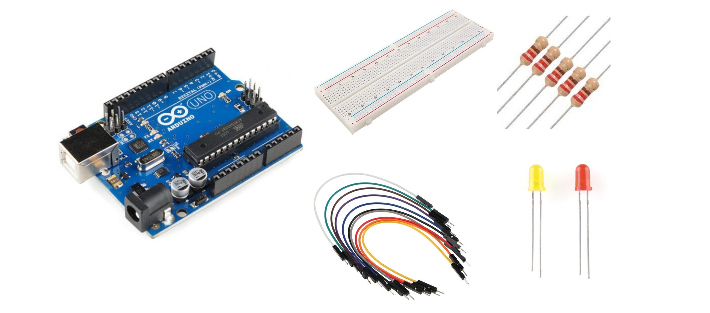
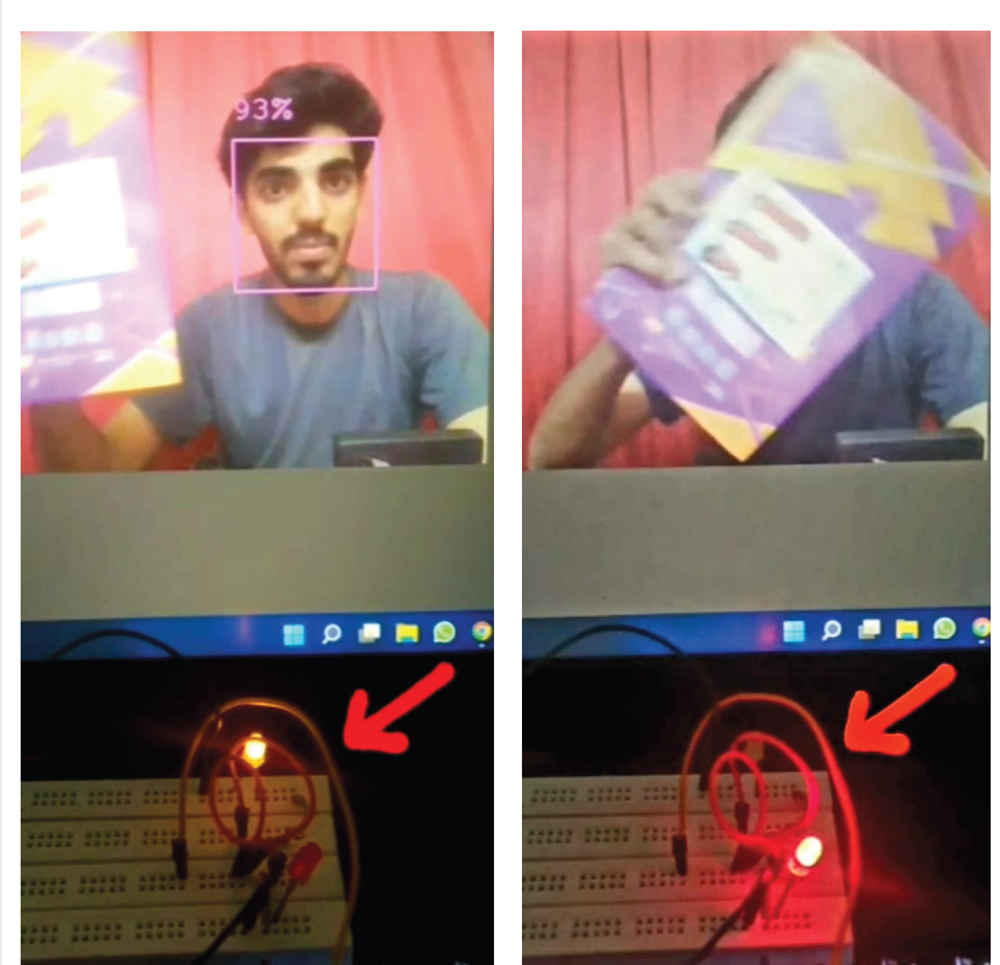

# 🎯 Face Detection System (Arduino + OpenCV)  

## 📌 Overview  
This project implements a **Face Detection System** using **OpenCV** and an **Arduino UNO**. The system detects a face using the **device camera**, and based on detection:  
- **Yellow LED** glows when a face is detected.  
- **Red LED** glows when no face is detected.  

This project is a simple yet effective demonstration of **computer vision** and **Arduino integration** for real-time face detection.  

---

## 📹 Demo Video  
[](https://youtube.com/shorts/2xxO79XVWUc)  

---

## ✨ Features  
✅ **Real-time Face Detection** using OpenCV.  
✅ **LED Indication**: Yellow for face detected, Red for no face.  
✅ **Arduino UNO Integration** with OpenCV.  
✅ **Beginner-friendly project** for learning Computer Vision and IoT.  

---

## 🛠 Technologies Used  

### **Software**  
- 🐍 **Python (OpenCV)** – Face detection.  
- 💡 **Arduino IDE** – Microcontroller programming.  
- 🔹 **PyCharm** – Python development environment.  


### **Hardware**  
- 🔌 **Arduino UNO** – Main microcontroller.  
- 🔴 **LEDs (Red & Yellow)** – Visual indicators.  
- 🔗 **Breadboard & Jumper Wires** – Circuit connections.  
- 🔧 **220Ω Resistors** – LED current limiting.
   

---

## 📂 File Structure  
```plaintext
Face-Detection-Arduino-OpenCV/
│── code/
│   │── face_detection.py
│   │── arduino_serial.py
│── images/
│   │── face_detection_output.png
│── README.md
│── LICENSE
```

---

## 🚀 How It Works  
1️⃣ The **Python script** uses OpenCV to detect faces via a camera.  
2️⃣ Once a face is detected, it sends a signal to **Arduino UNO**.  
3️⃣ The Arduino controls **LEDs** based on the received signal:  
   - **Yellow LED** ON → Face detected.  
   - **Red LED** ON → No face detected.  

---

## 🔧 Setup & Installation  

### **1️⃣ Hardware Setup**  
1. Connect **Arduino UNO** to a **breadboard**.  
2. Attach **Red & Yellow LEDs** with **220Ω resistors**.  
3. Connect LEDs to Arduino **digital pins (e.g., 7 & 8)**.  

### **2️⃣ Software Installation**  
🔹 Install **Python & OpenCV**:  
```sh
pip install opencv-python pyserial
```
🔹 Install **Arduino IDE** and upload the code to Arduino.  

---

## 🎮 Usage  

### **1️⃣ Run Python Face Detection Script**  
```sh
python face_detection.py
```
### **2️⃣ Run Arduino Code**  
Upload the Arduino sketch using **Arduino IDE**.  

---

## 📸 Screenshots  

### **Face Detected (Yellow LED ON)**              ### **No Face Detected (Red LED ON)**  
  

---

## 🔮 Future Enhancements  
🚀 **Buzzer Alert** – Sound an alarm on detection.  
📡 **WiFi Integration** – Send data over IoT platforms.  
📱 **Mobile App Control** – Monitor detection remotely.  

---

## 📄 License  
This project is open-source under the **MIT License**.  

---

## 🤝 Contributing  
Contributions are welcome! Feel free to fork and submit PRs.  

---

## 📧 Contact  
For any questions or suggestions, reach out:  
- **Muhammad Fahad Imdad**  
- 📧 **Email**: [fahadimdad966@gmail.com](mailto:fahadimdad966@gmail.com)  
- 🔗 **LinkedIn**: [Muhammad Fahad Imdad](https://www.linkedin.com/in/muhammad-fahad-imdad)  
- 🐙 **GitHub**: [FahadImdad](https://github.com/FahadImdad)  

